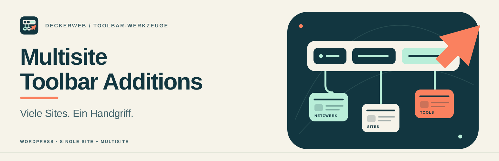

# Multisite Toolbar Additions

**Viele Sites. Ein Handgriff.**

[English](README.md) · [Deutsch](README-de.md) · [Releases](https://github.com/deckerweb/multisite-toolbar-additions/releases/latest)

Ein konfigurierbares WordPress-Menü in der Toolbar und nützliche Netzwerk-/Website-Verknüpfungen. Einzel-Websites und Multisite werden unterstützt: zentrale Einstellungen, unabhängige Menüquelle, Position, Frontend-/Admin-Anzeige, Gruppierung und Kindebenen.

## Inhalt

[Features](#features) · [Installation](#installation) · [Documentation](#documentation) · [FAQ](#faq) · [Changelog](#changelog)

## Features

- Direkte WordPress-Menüauswahl unabhängig vom Theme; optionale Netzwerk-Quellwebsite.
- Links zuerst/zuletzt, vor/nach Bezugspunkten oder rechts; Frontend/Admin/beide; Gruppierung und Tiefe.
- Schutz des gemeinsamen Multisite-Menüs; Zielgruppenwahl unter Beachtung der Zielseiten-Rechte.
- Getrennte + Neu-/ZIP-Untermenü-Schalter; Plugins standardmäßig an, Themes aus.
- Eigene Theme-ZIP-Seite und Netzwerk-Installationslinks; native WordPress-Uploadprüfung.
- Netzwerk-/Website-/Unterseiten-Verknüpfungen, erkannte Integrationen, Website-Zustand und Vollbild-Toolbar.
- deckerweb Library 0.2.0 mit neun freigegebenen Releases und Voraussetzungs-/Prüfsummenchecks.
- DECKERWEB GitHub Updater V2, Launch-Rail-Grafiken und gemeinsamer Footer.

## Installation

Benötigt **WordPress 6.7+ und PHP 8.2+**. Release-ZIP über Plugins → Installieren → Plugin hochladen installieren, in Multisite netzwerkweit aktivieren. Einstellungen → Toolbar Additions bzw. Netzwerkverwaltung → Einstellungen → Toolbar Additions öffnen. Der optionale Katalog-Installer benötigt zusätzlich PHP ZipArchive. Eigene 3.x-Snippets vor dem großen Upgrade prüfen.

## Documentation

[English guide](docs/wiki/English.md) · [Deutsche Anleitung](docs/wiki/Deutsch.md) · [FAQ — English](docs/wiki/FAQ-English.md) · [FAQ — Deutsch](docs/wiki/FAQ-Deutsch.md) · [Full changelog](docs/wiki/Changelog-English.md) · [Vollständiger Changelog](docs/wiki/Changelog-Deutsch.md)

Der Footer öffnet lokale Dokumentation und den vollständigen beigefügten Changelog. GitHub dokumentiert dieselben Themen. Siehe [Umstieg](docs/MIGRATION-4.0.md), [gemeinsame Libraries](docs/LIBRARIES.md) und [Prüfumfang](docs/VERIFICATION.md).

## FAQ

**Braucht es Multisite?** Nein, Einzel-Websites werden ebenfalls unterstützt.

**Kann ich Position und Tiefe wählen?** Ja: links/rechts, vor/nach Bezugspunkten und eine bis zehn Kindebenen oder alle.

**Folgt eine leere Beschriftung dem Menünamen?** Ja. Eine eigene Beschriftung überschreibt den gewählten WordPress-Menünamen.

**Wer darf das gemeinsame Multisite-Menü bearbeiten?** Super-Administratoren. Optionale Sichtbarkeit für Website-Administratoren vergibt keine zusätzlichen Rechte.

**Welche Plugin-/Theme-Erweiterungen sind standardmäßig an?** Plugins an, Themes aus, unabhängig für + Neu und ZIP-Untermenüs.

**Ruft der Katalog automatisch externe Daten ab?** Der beigefügte Katalog arbeitet lokal. Online-Aktualisierungen benötigen ausdrückliche Konfiguration. Installation lädt das ausgewählte GitHub-Release.

**Wie funktionieren Updates?** Über normale WordPress-Pluginupdates mit dem integrierten deckerweb Updater V2. Kein zusätzliches Plugin und kein Token erforderlich.

## Changelog

### 4.0.0 — 2026-10-01

- **New:** Einstellungsseite für Menüquelle, Anzeigeort, Zielgruppe, Position, Gruppierung und Kindebenen ergänzt.
- **New:** Getrennte Plugin-/Theme-Schalter für + Neu und ZIP-Untermenüs ergänzt; Plugins standardmäßig an, Themes aus.
- **New:** Eigene Theme-ZIP-Seite mit abgesichertem WordPress-Installer und Multisite-Netzwerklinks ergänzt.
- **New:** deckerweb Plugin Library 0.2.0 integriert: freigegebene Releases, lokale Icons, Abhängigkeitsprüfungen und optionale Katalogeinstellungen.
- **Improved:** Plugin mit kleinen Klassen neu aufgebaut, Menüdaten je Anfrage wiederverwendet und zusätzliche Unterseiten-Verknüpfungen begrenzt.
- **Improved:** Plugin- und Theme-Einträge unter + Neu ans Ende gesetzt; leere Gruppenbeschriftung übernimmt den WordPress-Menünamen.
- **Improved:** Launch-Rail-Grafiken und gemeinsamen Footer mit sprachabhängiger Dokumentation und vollständigem lokalem Changelog eingeführt.
- **Fixed:** Einstellungsrechte/Nonces und Menüausgabe abgesichert; gemeinsame Menüs in klassischen Formularen, REST und Customizer geschützt.
- **Fixed:** Icons zwischengespeicherter Update-Angebote über den gemeinsamen DECKERWEB GitHub Release Updater V2 wiederhergestellt.
- **Misc:** WordPress 6.7 und PHP 8.2 vorausgesetzt; deutsche informelle/formelle Übersetzungen und zweisprachige Dokumentation beigefügt.
- **Misc:** Verlauf von 3.1.0/3.0.0/2.x und ältere Versionen erhalten; inkompatible Änderungen und entfernte veraltete Links dokumentiert.

[Full history](docs/CHANGELOG-de.md) · [Releases](https://github.com/deckerweb/multisite-toolbar-additions/releases)

## About

Für kurze Wege bei der täglichen WordPress-/Netzwerkverwaltung. Keine Telemetrie. Menüdaten werden je Anfrage wiederverwendet; kein dauerhafter Cache fertiger Menüausgaben. Die Library verwendet standardmäßig einen lokalen Katalog; GitHub-Updates und ausdrücklich ausgelöste Release-Installationen kontaktieren GitHub.

[Issues](https://github.com/deckerweb/multisite-toolbar-additions/issues) · [Support development](https://www.paypal.me/deckerweb)

© 2012–2026 David Decker – DECKERWEB · [GPL-2.0-or-later](LICENSE)
