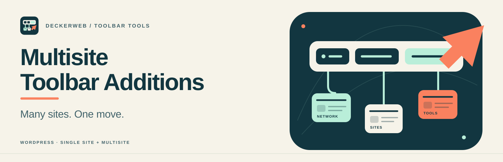

# Multisite Toolbar Additions

**Many sites. One move.**

[English](README.md) · [Deutsch](README-de.md) · [Releases](https://github.com/deckerweb/multisite-toolbar-additions/releases/latest)

A configurable WordPress toolbar menu and useful network/site shortcuts. Supports single sites and Multisite with centralized settings, independent menu source, placement, frontend/admin display, grouping and child depth.

## Contents

[Features](#features) · [Installation](#installation) · [Documentation](#documentation) · [FAQ](#faq) · [Changelog](#changelog)

## Features

- Direct WordPress menu selection, independent of theme locations; optional network-wide source website.
- First/last, before/after references or right-side position; frontend/admin/both; grouping and child depth.
- Shared Multisite menu protection; audience options with destination capabilities retained.
- Independent + New / ZIP submenu switches; Plugins on and Themes off by default.
- Dedicated theme ZIP page and network installation links; native WordPress upload handlers.
- Network/site/subsite shortcuts, detected integrations, Site Health and fullscreen editor toolbar.
- Bundled deckerweb Library 0.2.0 with nine approved releases and prerequisite/hash checks.
- DECKERWEB GitHub Updater V2, Launch Rail artwork and shared footer.

## Installation

Requires **WordPress 6.7+ and PHP 8.2+**. Install the release ZIP through Plugins → Add New → Upload Plugin. In Multisite use network activation. Open Settings → Toolbar Additions, or Network Admin → Settings → Toolbar Additions. The optional catalog installer additionally requires PHP ZipArchive. Test custom 3.x snippets before this major upgrade.

## Documentation

[English guide](docs/wiki/English.md) · [Deutsche Anleitung](docs/wiki/Deutsch.md) · [FAQ — English](docs/wiki/FAQ-English.md) · [FAQ — Deutsch](docs/wiki/FAQ-Deutsch.md) · [Full changelog](docs/wiki/Changelog-English.md) · [Vollständiger Changelog](docs/wiki/Changelog-Deutsch.md)

The footer opens local documentation and the complete bundled changelog. GitHub documentation mirrors the same topics. See [migration notes](docs/MIGRATION-4.0.md), [shared libraries](docs/LIBRARIES.md) and [verification scope](docs/VERIFICATION.md).

## FAQ

**Does it require Multisite?** No. It supports single sites too.

**Can I choose the menu position and depth?** Yes: left/right, before/after references, one to ten child levels or all.

**Does an empty group label follow the menu name?** Yes. A custom label overrides the selected WordPress menu name.

**Who can edit the shared Multisite menu?** Super administrators. Optional viewing by website administrators grants no extra rights.

**Which Plugin/Theme additions are on by default?** Plugin entries are on, Theme entries off, independently for + New and ZIP submenus.

**Does the catalog make background requests?** The bundled catalog works locally. Optional online catalog updates need explicit configuration. Installation downloads the selected GitHub release.

**How do updates work?** Through normal WordPress plugin updates using the bundled deckerweb Updater V2. No extra plugin or token required.

## Changelog

### 4.0.0 — 2026-10-01

- **New:** Adds a settings page for menu source, context, audience, position, grouping and child depth.
- **New:** Adds independent Plugin/Theme switches for + New and ZIP upload sidebar entries, with plugin-on/theme-off defaults.
- **New:** Adds a dedicated theme ZIP upload page using WordPress’s signed installer, including Multisite network links.
- **New:** Bundles deckerweb Plugin Library 0.2.0: approved releases, local icons, dependency checks and optional catalog settings.
- **Improved:** Rebuilds the plugin around small classes, reuses menu data per request and bounds additional subsite shortcuts.
- **Improved:** Shows Plugin and Theme entries last under + New; an empty grouped label follows the WordPress menu name.
- **Improved:** Introduces Launch Rail artwork and a shared footer with localized documentation and a complete local changelog.
- **Fixed:** Validates settings capabilities/nonces and escapes menu output; protects shared menu edits across classic forms, REST and Customizer.
- **Fixed:** Restores icons on cached WordPress update offers through the shared DECKERWEB GitHub Release Updater V2.
- **Misc:** Requires WordPress 6.7 and PHP 8.2; includes German informal/formal translations and bilingual documentation.
- **Misc:** Keeps the 3.1.0/3.0.0/2.x changelog and older history available, while documenting breaking changes and removed obsolete links.

[Full history](docs/CHANGELOG.md) · [Releases](https://github.com/deckerweb/multisite-toolbar-additions/releases)

## About

Built for a shorter path through everyday WordPress/network administration. No telemetry. Menu data is reused per request; no persistent rendered-menu cache is introduced. The library uses a local catalog by default; GitHub updates and explicit release installations contact GitHub.

[Issues](https://github.com/deckerweb/multisite-toolbar-additions/issues) · [Support development](https://www.paypal.me/deckerweb)

© 2012–2026 David Decker – DECKERWEB · [GPL-2.0-or-later](LICENSE)
